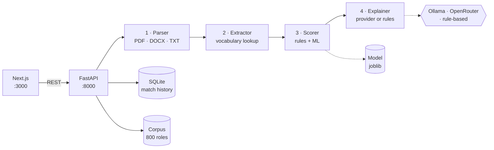

<div align="center">

# Recruiter Pro

**CV screening against a live job corpus — parse, extract, score, explain**

[](https://www.python.org/downloads/)
[](https://fastapi.tiangolo.com/)
[](https://nextjs.org/)
[](https://reactjs.org/)
[](https://www.typescriptlang.org/)

[](https://ollama.ai)
[](https://langchain.com)

[Quick start](#quick-start) · [Scoring](#scoring) · [Limits](#what-this-does-not-do) · [Architecture](#architecture) · [API](#api)

</div>

---

Upload a résumé. Four agents parse it, resolve its skills against a controlled
vocabulary, score it against all 800 roles in the corpus, and write an
explanation for each match — in **0.74 seconds**, with every component of every
score shown rather than asserted.

The interesting part of this project is not the pipeline. It is that the
pipeline is measured, and that the measurements are reported even where they are
unflattering — see [what this does not do](#what-this-does-not-do).

## What it does

| | |
|---|---|
| **Parse** | PDF, DOCX and plain text. The file's real bytes are checked against its extension before any parser touches it |
| **Extract** | Skills resolved to one canonical vocabulary — 679 skills behind 1,554 aliases — so React, ReactJS and React.js land on the same skill |
| **Score** | Five weighted rule-based components, optionally blended with a trained classifier, each reported separately |
| **Explain** | A written rationale per match, tagged with the provider that produced it, falling back to a rule-based writer when no model is reachable |

The corpus is **800 roles across 27 countries, 46 cities and 60 companies**, with
654 distinct skills between them. Every figure on the landing page comes from
`GET /stats` against the running corpus, so the marketing cannot drift from the
system.

## Scoring

```
rule_based = skill×0.50 + experience×0.20 + title×0.17 + education×0.08 + keyword×0.05
final      = rule_based×0.60 + ml×0.40        (rule_based alone when no model loads)
```

| Component | Weight | What it measures |
|---|:---:|---|
| Skill match | 50% | CV skills against the role's required and preferred skills, both resolved to the vocabulary |
| Experience | 20% | Years against the role's stated range, penalising both directions |
| Title similarity | 17% | The candidate's role against the job title |
| Education | 8% | Highest degree against the stated requirement |
| Keyword overlap | 5% | Terms from the description present in the CV |

These weights live in `config/agents.yaml` and nowhere else. There is no
semantic-similarity component; earlier versions of this file described one.

## What this does not do

Stated plainly, because a matching system that overstates its confidence is
worse than one that admits its bounds.

**The ML half contributes almost no ranking signal.** The hybrid score is 40%
ML, but for a fixed CV the model returns only *three distinct probabilities
across all 800 jobs* — the only per-job feature it sees is the job title. The ML
term shifts scores nearly uniformly instead of ordering them, so the ranking you
see is effectively the rule-based score.

**The training dataset cannot produce an honest ATS model.** `Recruiter Decision`
is a pure threshold on `AI Score` (≥65 → Hire). `AI Score` is excluded from
training, but the remaining columns reconstruct the decision anyway:
**`Experience` alone reaches ROC-AUC 0.9244, and `Experience + Projects Count`
reaches 0.9933.** Two ordinary columns. The headline metrics are therefore a
property of the dataset, not evidence of a good model — which is why no accuracy
figure appears anywhere in this application's UI or its `/stats` endpoint, and a
test asserts that none appears.

**The corpus is synthetic.** The 800 descriptions were generated against the
vocabulary so that skill matching has something coherent to match. They are
realistic, not real.

**There is no fairness evaluation.** No bias audit, no adverse-impact testing, no
protected-attribute analysis. This is a portfolio and learning project. It should
not be used to make real hiring decisions.

## Quick start

**Prerequisites:** Python 3.10+, Node.js 18+. No LLM required — the rule-based
explanation provider is first-class, so the app runs with no Ollama, no API key
and no quota.

```bash
git clone https://github.com/Sharawey74/Recruiter-Pro.git
cd Recruiter-Pro
pip install -r requirements.txt
cd frontend && npm install && cd ..
```

```powershell
.\run.ps1
```

One window. It starts both services, waits until each is genuinely answering,
streams both logs with an `[api]` / `[web]` prefix, and stops both on Ctrl-C. It
reports what the backend actually loaded — the corpus size, and whether hybrid
scoring is running or it fell back to rules — because both degrade silently.

| Flag | Effect |
|---|---|
| `-Prod` | Build and serve the production bundle instead of the dev server |
| `-ApiPort` / `-WebPort` | Use different ports. CORS and `NEXT_PUBLIC_API_URL` follow automatically |
| `-Force` | Stop whatever holds a port first — only that process, never by name |
| `-NoBrowser` | Do not open a browser |

<details>
<summary>Starting the two services by hand</summary>

```bash
python -m uvicorn src.api:app --reload --port 8000   # terminal 1
cd frontend && npm run dev                            # terminal 2
```

</details>

Frontend on `:3000`, API on `:8000`, interactive API docs at `/docs`.

## Architecture

A monolith with a modular agent pipeline. The agents are separate modules in one
process, communicating by function call — there is no network hop between them,
and at this scale there is no reason for one.



Agent 4 sits behind a provider protocol ([ADR-2](docs/adr/)), which is what lets
the whole suite run in CI with no network, no key and no model. Every match
reports `explanation_source`, so a silent fall back to rule-based prose is
visible rather than merely plausible.

<details>
<summary>Project layout</summary>

```
src/
├── api.py                    FastAPI application, 11 endpoints
├── agents/
│   ├── agent1_parser.py      document → text
│   ├── agent2_extractor.py   text → structured profile
│   ├── agent3_scorer.py      profile + job → score breakdown
│   ├── scoring/              components, skill matcher, ML scorer
│   ├── explaining/           protocol + ollama, openrouter, langchain, rule_based
│   └── pipeline.py           orchestrator
├── core/                     config, controlled vocabulary
├── ml_engine/                training, evaluation, prediction
└── storage/                  SQLite, Pydantic models

frontend/app/                 landing, dashboard, upload, jobs, results, history, shortlist
data/json/jobs.json           the 800-role corpus
config/agents.yaml            scoring weights — the only place they live
tests/                        unit (25) · integration (4) · system (1)
```

</details>

## API

Eleven endpoints. Interactive documentation at `/docs`.

| Endpoint | Purpose |
|---|---|
| `POST /match` | Score a CV against the whole corpus. Returns ranked matches with a full breakdown |
| `POST /match/single` | Score a CV against one role |
| `POST /upload` | Parse and extract without scoring |
| `GET /jobs` | Browse the corpus — `search`, `category`, `remote_type`, `seniority`, paged |
| `GET /jobs/facets` | The filter values that actually occur in the corpus |
| `GET /jobs/{job_id}` | One role, untruncated |
| `GET /stats` | Live corpus and engine figures |
| `GET /health` | Corpus size, ML model state, database readiness |
| `GET`/`DELETE /match/history` | Stored matches |

<details>
<summary>Example — <code>POST /match</code></summary>

```http
POST /match?top_k=5&explain=true HTTP/1.1
Content-Type: multipart/form-data

file: <resume.pdf>
```

```jsonc
{
  "matches": [
    {
      "match_id": "…",
      "job_title": "Machine Learning Engineer",
      "company_name": "Vireo Environmental",
      "final_score": 78.4,
      "rule_based_score": 74.1,   // the five weighted components combined
      "skill_score": 82.0,
      "experience_score": 91.0,
      "ml_score": 85.2,           // null when no model is loaded
      "matched_skills": ["Python", "Machine Learning"],
      "missing_skills": ["Kubernetes"],
      "explanation": "…",
      "explanation_source": "openrouter"
    }
  ],
  "jobs_evaluated": 800,
  "processing_time": 0.74,
  "scoring_mode": "hybrid"
}
```

Score fields are named for what they measure. They were once `parser_score`,
`matcher_score` and `scorer_score` — named after the agent they passed through,
which described none of them correctly.

</details>

## Testing

```bash
pytest                                              # the whole suite
pytest --cov=src --cov-report=term --cov-branch     # with coverage
```

**514 tests, 1 skipped, 83% branch coverage of `src/`.** The suite runs in CI on
every push with no network, no API key and no model. CI also runs `ruff`, the
corpus validator, a byte-level scan for stray control characters, a
prefix-anchored credential scan, and `tsc` / `eslint` / `next build` for the
frontend.

The one skip is honest: it guards against the detail view truncating a
requirement list the grid caps at ten, and no role in the corpus has ten — the
maximum is nine. It skips rather than passing vacuously.

> A quarter of this suite once failed on every run, and 33 tests could never have
> passed: 23 targeted an API surface this repository has never served, and 10
> collected their measurements inside a condition that was never true, so they
> reported green while asserting nothing. Writing the replacements found two
> endpoints that had returned 500 on every call ever made to them.

## Configuration

Copy `.env.example` to `.env`. Every variable is optional and falls back to
`config/agents.yaml`, then to the defaults in `src/core/config.py`.

| Variable | Default | Notes |
|---|---|---|
| `API_PORT` | `8000` | |
| `CORS_ORIGINS` | `http://localhost:3000` | A real control. Never `*` — the spec forbids it with credentials |
| `RATE_LIMIT_ENABLED` | `true` | Per-IP limits on `/match` and `/upload` |
| `LLM_PROVIDER` | `ollama` | `ollama` · `openrouter` · `langchain` · `rule_based` |
| `OPENROUTER_API_KEY` | — | Environment only. Never committed, never logged, never returned in a response |
| `LLM_DAILY_QUOTA` | `200` | Counted in SQLite so it survives a restart; degrades to rule-based rather than breaking |
| `DATABASE_PATH` | `data/database/match_history.db` | |

Scoring weights are in `config/agents.yaml` and are validated on load — a set
that does not sum to 1.0 fails at import with the offending values named.

## Performance

| | Before | After |
|---|---|---|
| One CV against all 800 roles | 16.64 s | **0.74 s** |
| Database writes per upload | one per job | one per returned match |
| ML model calls per upload | one per job | one, vectorised |

The 22× came from three changes: writing only the top-K matches instead of a row
per job, one `predict_proba` over the whole frame instead of 800 calls, and
normalising the CV once rather than once per comparison. All measured against
the same corpus, not estimated.

## Contributing

Issues and pull requests are welcome. Run `pytest` and `ruff check src/ scripts/
tests/` before opening one; CI runs both and will not merge red. Commits follow
Conventional Commits — see `.gitmessage`.

## License

MIT — see [LICENSE](LICENSE).

The job corpus is generated. `data/AI_Resume_Screening.csv` is a public synthetic
résumé-screening dataset, included so the training pipeline has something to run
against; the analysis above explains why its labels cannot support an honest
model.
