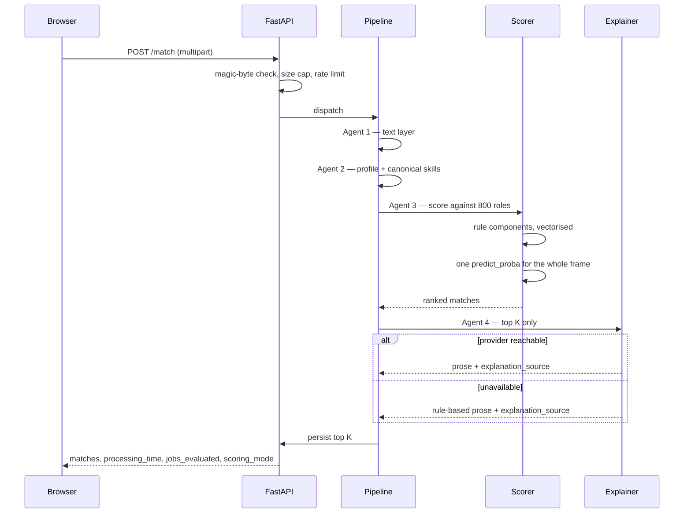

<div align="center">

# Recruiter Pro

**CV screening against a live job corpus — parse, extract, score, explain**

[](https://www.python.org/downloads/)
[](https://fastapi.tiangolo.com/)
[](https://nextjs.org/)
[](https://reactjs.org/)
[](https://www.typescriptlang.org/)

[](https://ollama.ai)
[](https://langchain.com)

[Metrics](#by-the-numbers) · [Features](#features) · [Scoring](#scoring) · [Quick start](#quick-start) · [Architecture](#architecture) · [API](#api) · [Testing](#testing-and-quality-gates)

</div>

---

Upload a résumé. Four agents parse it, resolve its skills against a controlled
vocabulary, score it against all 800 roles in the corpus, and write an
explanation for each match — in **0.74 seconds**, with every component of every
score shown rather than asserted.

The interesting part of this project is not the pipeline. It is that the
pipeline is measured — every figure below is a reading taken from the running
system, not a target it was designed to hit.

## By the numbers

Every figure carries the command that produces it, so any of them can be
checked rather than taken on trust. Nothing here is a projection or a target.

**What it scores against** — served live by `GET /stats`, so this table and the
product cannot disagree.

| Roles | Countries | Cities | Companies | Distinct skills | Categories | Seniority levels | Work models |
|:--:|:--:|:--:|:--:|:--:|:--:|:--:|:--:|
| **800** | **27** | **46** | **60** | **654** | **8** | **6** | **3** |

**How it scores** — `GET /stats`, and `config/agents.yaml` for the weights.

| Metric | Value | Meaning |
|---|--:|---|
| Pipeline agents | **4** | Parse, extract, score, explain |
| Canonical skills | **679** | The controlled vocabulary skills resolve to |
| Skill aliases | **1,554** | Surface forms mapping onto those 679 |
| Scoring components | **5** | Weighted, and each returned separately |
| Explanation providers | **4** | One protocol; three remote, one local |
| API routes | **11** | Across ten paths |

**Measured performance** — `pytest tests/system/`, same corpus before and after.

| Metric | Before | After | Change |
|---|--:|--:|--:|
| One CV against all 800 roles | 16.64 s | **0.74 s** | **22× faster** |
| Database writes per upload | 800 rows | 1 transaction | **114× cheaper per row** |
| Model calls per upload | 800 | 1 vectorised | **245× faster** |

**Verification** — `pytest --cov=src --cov-branch`, and `.github/workflows/ci.yml`.

| Metric | Value | Meaning |
|---|--:|---|
| Tests passing | **514** | 1 skipped, and the skip is explained below |
| Branch coverage | **83%** | Branch, not statement — the stricter measure |
| CI checks | **9** | All blocking except the formatter |
| Decision records | **3** | The design choices that needed an argument |

<details>
<summary><b>Codebase size</b> — <code>git ls-files</code></summary>

| Area | Files | Lines |
|---|--:|--:|
| `src/` — application and ML engine | 35 | 7,424 |
| `tests/` — unit, integration, system | 36 | 6,432 |
| `frontend/` — TypeScript and TSX | 41 | 6,308 |
| `scripts/` — tooling, validators, scanners | 20 | 3,403 |
| **Total tracked** | **188** | **23,567** |

The frontend is 8 routes built from 17 components; the backend serves 11 routes
across 10 paths.

</details>

## Features

### The pipeline

Four agents, each with one job and a defined contract between them.

| | Agent | What it does | Notable |
|:--:|---|---|---|
| **1** | **Parser** | PDF, DOCX and plain text reduced to a clean text layer | The file's real bytes are checked against its extension before any parser touches it — a `.exe` renamed `.pdf` is refused |
| **2** | **Extractor** | Skills, experience, education and contact details pulled into a structured profile | Skills resolve to one canonical vocabulary, so React, ReactJS and React.js land on the same skill |
| **3** | **Scorer** | Five weighted rule components, optionally blended with a trained classifier | Every component is returned separately, so a total can always be reconstructed from its parts |
| **4** | **Explainer** | A written rationale per match | Tagged with the provider that produced it, and degrades to a rule-based writer rather than failing |

### The application

| Feature | Detail |
|---|---|
| **Full-corpus scoring** | One upload is ranked against all 800 roles in a single pass, not a job at a time |
| **Explainable by construction** | Skill, experience, title, education, keyword and ML sub-scores are all in the payload — nothing is a black box |
| **Skill gap analysis** | Matched and missing skills per role, resolved through the vocabulary rather than by string equality |
| **Searchable corpus** | Server-side search across title, company, city and skill, with category, work-model and seniority filters drawn from the corpus itself |
| **Provider independence** | Ollama, OpenRouter, LangChain or rule-based — selected by config, behind one protocol |
| **Honest degradation** | If the ML model or the LLM is unavailable the app keeps working and says so; it never presents a rule-based result as a model-backed one |
| **Persistent history** | Every match written to SQLite, browsable and clearable from the UI |
| **Shortlisting** | Accept and reject decisions per match, persisted across sessions |
| **Budget guards** | A daily LLM quota counted in SQLite, a concurrency cap, and a per-request explanation limit |
| **Responsive interface** | Eight pages on a Material 3 token set, with a drawer navigation below `lg` and no horizontal scroll at 375px |
| **Accessible motion** | Every animation is disabled under `prefers-reduced-motion`, and no content depends on an animation running to become visible |

## Scoring

```
rule_based = skill×0.50 + experience×0.20 + title×0.17 + education×0.08 + keyword×0.05
final      = rule_based×0.60 + ml×0.40        (rule_based alone when no model loads)
```

| Component | Weight | What it measures |
|---|:---:|---|
| Skill match | 50% | CV skills against the role's required and preferred skills, both resolved to the vocabulary |
| Experience | 20% | Years against the role's stated range, penalising both directions |
| Title similarity | 17% | The candidate's role against the job title |
| Education | 8% | Highest degree against the stated requirement |
| Keyword overlap | 5% | Terms from the description present in the CV |

These weights live in `config/agents.yaml` and nowhere else. They are validated
on load — a set that does not sum to 1.0 fails at import with the offending
values named. There is no semantic-similarity component; earlier versions of
this file described one.

## Quick start

**Prerequisites:** Python 3.10+, Node.js 18+. No LLM required — the rule-based
explanation provider is first-class, so the app runs with no Ollama, no API key
and no quota.

```bash
git clone https://github.com/Sharawey74/Recruiter-Pro.git
cd Recruiter-Pro
pip install -r requirements.txt
cd frontend && npm install && cd ..
```

```powershell
.\run.ps1
```

One window. It starts both services, waits until each is genuinely answering,
streams both logs with an `[api]` / `[web]` prefix, and stops both on Ctrl-C. It
reports what the backend actually loaded — the corpus size, and whether hybrid
scoring is running or it fell back to rules — because both degrade silently.

| Flag | Effect |
|---|---|
| `-Prod` | Build and serve the production bundle instead of the dev server |
| `-ApiPort` / `-WebPort` | Use different ports. CORS and `NEXT_PUBLIC_API_URL` follow automatically |
| `-Force` | Stop whatever holds a port first — only that process, never by name |
| `-NoBrowser` | Do not open a browser |

<details>
<summary>Starting the two services by hand</summary>

```bash
python -m uvicorn src.api:app --reload --port 8000   # terminal 1
cd frontend && npm run dev                            # terminal 2
```

</details>

Frontend on `:3000`, API on `:8000`, interactive API docs at `/docs`.

## Architecture

A monolith with a modular agent pipeline. The agents are separate modules in one
process communicating by function call — there is no network hop between them,
and at this scale there is no reason for one. The seam that matters is not
between services; it is between the scorer and the thing that explains the score,
and that one is a protocol.

### System design

Three layers and their resources. Everything inside the pipeline box is one
process — the arrows between agents are function calls, not requests.

```
┌──────────────────────────────────────────────────────────────────────────────┐
│ CLIENT                                                  Next.js 16  ·  :3000 │
│                                                                              │
│ 8 routes  ·  17 components                                                   │
│ session state in localStorage, read via useSyncExternalStore                 │
└───────────────────────────────────────┬──────────────────────────────────────┘
                                        │  REST / JSON
                                        ▼
┌──────────────────────────────────────────────────────────────────────────────┐
│ API                                              FastAPI · uvicorn  ·  :8000 │
│                                                                              │
│ 11 routes  ─▶  magic bytes  ─▶  10 MB cap  ─▶  5/min per IP                  │
└───────────────────────────────────────┬──────────────────────────────────────┘
                                        │  dispatch
                                        ▼
┌──────────────────────────────────────────────────────────────────────────────┐
│ PIPELINE                              four agents · one process · no network │
│                                                                              │
│ ┌────────────┐   ┌────────────┐   ┌────────────┐   ┌────────────┐            │
│ │ 1  PARSER  │──▶│ 2 EXTRACT  │──▶│ 3  SCORER  │──▶│ 4 EXPLAIN  │            │
│ │            │   │            │   │            │   │            │            │
│ │ pdf · docx │   │   skills   │   │ 5 weighted │   │ top-K only │            │
│ │    txt     │   │   years    │   │ rules + ML │   │ never 800  │            │
│ └────────────┘   └─────┬──────┘   └─────┬──────┘   └─────┬──────┘            │
│                        │                │                │                   │
└──────────────────────────────────────────────────────────────────────────────┘
                         │                │                │
      ┌──────────────────┴────┐  ┌────────┴───────────┐  ┌─┴────────────────────────┐
      │ VOCABULARY            │  │ CORPUS + MODEL     │  │ PROVIDER PROTOCOL        │
      │ 679 canonical skills  │  │ 800 roles          │  │ ollama · openrouter      │
      │ 1,554 aliases         │  │ 1 predict_proba    │  │ langchain · rule_based   │
      └───────────────────────┘  └────────────────────┘  └──────────────────────────┘
```

SQLite holds the match history and the daily LLM quota. Every match carries an
`explanation_source`, so which of the four providers answered is recorded rather
than inferred.

### Request lifecycle

The same system in time rather than in space — one `POST /match`, from upload to
response, including the branch where the explanation provider is unreachable.



The explanation step is capped at the top K rather than run per job — that cap,
plus the daily quota and the concurrency limit, is what keeps a public instance
from spending its budget on one upload.

<details>
<summary><b>Design decisions worth reading</b></summary>

Three architecture decision records live in [`docs/adr/`](docs/adr/):

| ADR | Decision |
|---|---|
| **1** | Where the LLM is allowed to act, and where it is not |
| **2** | Agent 4 behind a provider protocol, with rule-based as a first-class implementation rather than a fallback afterthought |
| **3** | One controlled skill vocabulary, replacing four competing ones |

ADR-2 is why the entire test suite runs in CI with no network, no API key and no
model — and why every match reports `explanation_source`, so a silent fall back
to rule-based prose is visible rather than merely plausible.

</details>

<details>
<summary><b>Project layout</b></summary>

```
src/
├── api.py                    FastAPI application, 11 routes
├── agents/
│   ├── agent1_parser.py      document → text
│   ├── agent2_extractor.py   text → structured profile
│   ├── agent3_scorer.py      profile + job → score breakdown
│   ├── scoring/              components, skill matcher, ML scorer
│   ├── explaining/           protocol + ollama, openrouter, langchain, rule_based
│   └── pipeline.py           orchestrator
├── core/                     config, controlled vocabulary
├── ml_engine/                training, evaluation, prediction
└── storage/                  SQLite, Pydantic models

frontend/app/                 landing, dashboard, upload, jobs, results, history, shortlist
frontend/components/          layout, landing, jobs, match, pipeline, ui
data/json/jobs.json           the 800-role corpus
config/agents.yaml            scoring weights — the only place they live
tests/                        unit (25) · integration (4) · system (1)
```

</details>

## API

Eleven routes across ten paths. Interactive documentation at `/docs`.

| Method | Path | Purpose | Parameters |
|---|---|---|---|
| `POST` | `/match` | Score a CV against the whole corpus | `top_k`, `explain` · rate limited 5/min |
| `POST` | `/match/single` | Score a CV against one role | `job_id` |
| `POST` | `/upload` | Parse and extract without scoring | rate limited 10/min, 10 MB cap |
| `GET` | `/jobs` | Browse the corpus | `search`, `category`, `remote_type`, `seniority`, `limit`, `skip` |
| `GET` | `/jobs/facets` | Filter values that actually occur in the corpus | — |
| `GET` | `/jobs/{job_id}` | One role, untruncated | — |
| `GET` | `/stats` | Live corpus and engine figures | — |
| `GET` | `/health` | Corpus size, ML state, database readiness | — |
| `GET` | `/match/history` | Stored matches, newest first | `limit` |
| `DELETE` | `/match/history` | Clear stored matches | — |
| `GET` | `/` | Service banner | — |

<details>
<summary>Example — <code>POST /match</code></summary>

```http
POST /match?top_k=5&explain=true HTTP/1.1
Content-Type: multipart/form-data

file: <resume.pdf>
```

```jsonc
{
  "matches": [
    {
      "match_id": "…",
      "job_title": "Machine Learning Engineer",
      "company_name": "Vireo Environmental",
      "final_score": 78.4,
      "rule_based_score": 74.1,   // the five weighted components combined
      "skill_score": 82.0,
      "experience_score": 91.0,
      "ml_score": 85.2,           // null when no model is loaded
      "matched_skills": ["Python", "Machine Learning"],
      "missing_skills": ["Kubernetes"],
      "explanation": "…",
      "explanation_source": "openrouter"
    }
  ],
  "jobs_evaluated": 800,
  "processing_time": 0.74,
  "scoring_mode": "hybrid"
}
```

Score fields are named for what they measure. They were once `parser_score`,
`matcher_score` and `scorer_score` — named after the agent they passed through,
which described none of them correctly.

</details>

## Performance

The headline is 16.64 s to **0.74 s** for one CV against all 800 roles — the
figures are in [By the numbers](#by-the-numbers). Three changes got it there:

**Persist once, not per job.** `save_match` opened a connection, committed and
closed for every row: 800 connections per upload. `save_matches_batch` does the
same work in one transaction, and only for the matches actually returned.

**One `predict_proba`, not 800.** The ML scorer built a one-row DataFrame and
ran the fitted transform per job. One frame, one transform, one call now covers
the whole corpus.

**Normalise the CV once.** Its skill set was being resolved to the vocabulary
again for every comparison, when it does not change between them.

None of these are estimates, and none of them rest on a stopwatch reading from a
particular machine. `tests/system/test_performance.py` re-measures the batch path
against the per-row path in the same process on every CI run and fails if the
gap closes — the ratio is currently **114×**, and the test's floor is 5×.

## Testing and quality gates

```bash
pytest                                              # the whole suite
pytest --cov=src --cov-report=term --cov-branch     # with coverage
```

**515 tests collected — 514 passing, 1 skipped, 83% branch coverage of `src/`,
2 warnings**, both from a dependency. The suite runs with no network, no API key
and no model.

Nine checks run in CI on every push and pull request:

| | Check | Scope |
|:--:|---|---|
| 1 | `ruff` | `src/ scripts/ tests/`, blocking |
| 2 | `black --check` | non-blocking until a format commit lands |
| 3 | `pytest` with branch coverage | the whole suite |
| 4 | Corpus validator | structural integrity of all 800 roles |
| 5 | Control-character scan | 138 files, byte level |
| 6 | Credential scan | 181 tracked files, prefix-anchored |
| 7 | `tsc --noEmit` | frontend types |
| 8 | `eslint` | frontend lint |
| 9 | `next build` | production build, 9 routes |

The one skip is honest: it guards against the detail view truncating a
requirement list the grid caps at ten, and no role in the corpus has ten — the
maximum is nine. It skips rather than passing vacuously.

> A quarter of this suite once failed on every run, and 33 tests could never have
> passed: 23 targeted an API surface this repository has never served, and 10
> collected their measurements inside a condition that was never true, so they
> reported green while asserting nothing. Writing the replacements found two
> endpoints that had returned 500 on every call ever made to them.

## Security

| Control | Implementation |
|---|---|
| Upload validation | Magic bytes checked against the extension; a `.exe` renamed `.pdf` is refused before a parser sees it |
| Upload ceiling | 10 MB, enforced by streaming rather than an unbounded `read()` |
| Rate limiting | Per IP — 5/min on `/match`, 10/min on `/upload` |
| CORS | An explicit allowlist. Never `*`, which the spec forbids alongside credentials |
| Secrets | Environment only. Never committed, never logged, never returned in a response |
| Credential scanning | Prefix-anchored patterns for nine vendors, blocking in CI, with a history-audit mode |
| Budget control | Daily LLM quota in SQLite, concurrency cap, per-request explanation limit |

## Configuration

Copy `.env.example` to `.env`. Every variable is optional and falls back to
`config/agents.yaml`, then to the defaults in `src/core/config.py`.

| Variable | Default | Notes |
|---|---|---|
| `API_PORT` | `8000` | |
| `CORS_ORIGINS` | `http://localhost:3000` | A real control, not a formality |
| `RATE_LIMIT_ENABLED` | `true` | |
| `LLM_PROVIDER` | `ollama` | `ollama` · `openrouter` · `langchain` · `rule_based` |
| `OPENROUTER_API_KEY` | — | Environment only |
| `LLM_DAILY_QUOTA` | `200` | Degrades to rule-based rather than breaking |
| `LLM_MAX_CONCURRENT_CALLS` | `2` | Free tiers answer excess concurrency with 429s |
| `DATABASE_PATH` | `data/database/match_history.db` | |


## Star this repo

If the honest-metrics approach was useful to you — the leakage analysis, the
provider protocol, or the measured 22× — a star helps other people find it.

<div align="center">

[](https://github.com/Sharawey74/Recruiter-Pro/stargazers)
[](https://github.com/Sharawey74/Recruiter-Pro/network/members)
[](https://github.com/Sharawey74/Recruiter-Pro/issues)
[](LICENSE)

**[Star this repository](https://github.com/Sharawey74/Recruiter-Pro/stargazers)**

</div>


## License

MIT — see [LICENSE](LICENSE).

The job corpus is generated. `data/AI_Resume_Screening.csv` is a public synthetic
résumé-screening dataset, included so the training pipeline has something to run
against.

This is a portfolio and learning project. It has had no fairness or
adverse-impact evaluation and should not be used to make real hiring decisions.
